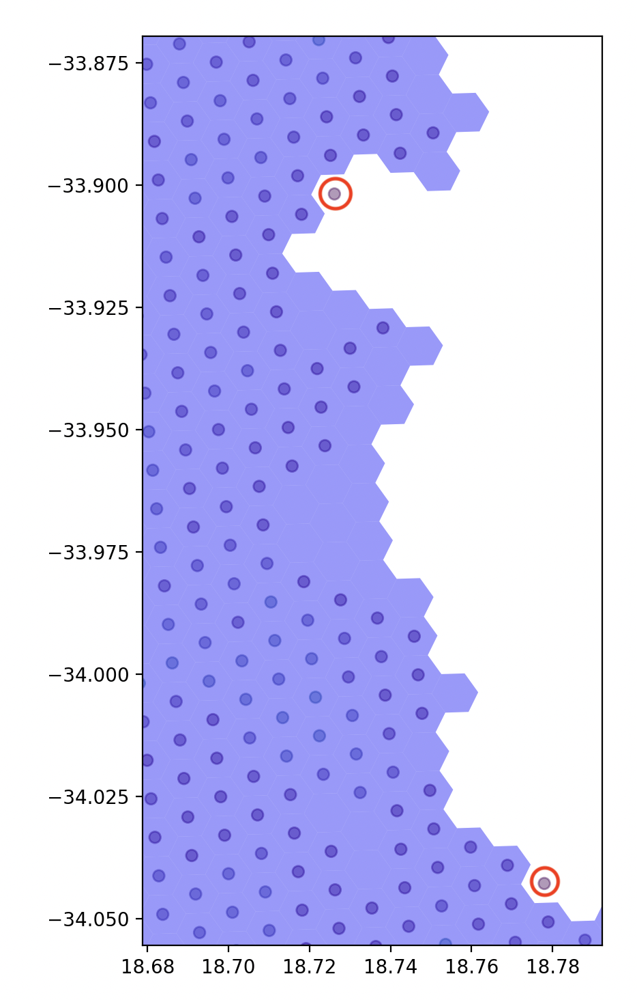

# Environment Requirements
- Python 3.10.* 
- venv

# Environment setup
```sh
# Clone and enter the repo
git clone git@github.com:HoosainEssop/ds_code_challenge.git && cd ds_code_challenge
git@github.com:HoosainEssop/ds_code_challenge.git

# Create Virtual Environment and Activate
python3 -m venv ds_env
# If using Linus or MacOs
source ds_env/bin/activate
# If Using Windows
activate

# install required packages
pip install -r requirements.txt
```

# Integration Testing
We have used data stored in an AWS S3 bucket throught these challenges. As such integration testig has been developed for the specific cases:
- Test integration to AWS using supplied credentials
- Test integration to create client using provided credentials
- Test integration to access files
```sh
python3 src/integration_test.py
```

# Executing the challenge submissions
## Challenge 1
A python script has been developed for the challenge. Titled as:
- Challenge 1 : src/Submission_1.py

Steps taken In Solution:
- 1. init client
- 2. Get Challenge File Data into GeoDataFrame: city-hex-polygons-8-10.geojson WHERE resolution = 8
- 3. Get Validation File Data into GeoDataFrame:  city-hex-polygons-8.geojson
- 4. Validate Stream/Challenge Data aginst validation data
- 5. Log Challenge Status

```sh
# Execute Challenge 1 Submission
python3 src/Submission_1.py
```

## Challenge 2
A python script has been developed for the challenge. Titled as:
- Challenge 2 : src/Submission_2.py

Steps taken In Solution:
1. init client
2. Get Challenge File service request Data into GeoDataFrame: sr.csv.gz
3. Get Challenge 1 Validation File Data into GeoDataFrame: city-hex-polygons-8.geojson
4. Get Challenge 2 Validation File Data into GeoDataFrame: sr_hex.csv.gz
5. Overlay polygons to get an understanding wrt the error tolerance
    - Code appropriated from : https://github.com/uber/h3-py-notebooks/blob/master/notebooks/unified_data_layers.ipynb
    - Steps:
        1. calculale the h3 index's for the lat lon pair at a given resolution
        1. remove records where lat and lon is null, resulting in a 0 hex value
        1. Create a frame that contains the count of each hex index
        1. find center of hex for visualization
        1. Create the geodataframe for the aggregated service requests
        1. Create a geodataframe for the service requests
        1. Plot the two geodataframes on the same axis.
    - Result: identified 2 Sr records that do not lie in a hex at point (-34.044257, 18.774378) and 1 at point (-33.904955, 18.723060)
    - Output plot has been commented out of code as was used for investigative purposes. Image attached here for reference:
    
6. Set an Error Threshold of 1%
    - This caters for any data capture issues and rounding errors. This is significantly less than what we have encounted in the above plot, where three missing records were identified
7. Calculate error records percentage after joining the sr dataset to the city-hex-polygons-8 dataset
8. Compared the result of the join in step 7 to the Validation dataframe in step 4
9. Log Challenge Status

```sh
# Execute Challenge 2 Submission
python3 src/Submission_2.py
```

# Final Notes to Reviewers
All code has been developed by myself and references have been added where code was appropriated.

Unfortunately due to time constraints I have not been able to deliver a successfull attempt at challenge 3. Majority of my work experience is based on Apache Spark Notebooks and using Azure Data Factory Pipelines, as such I am a bit rusty with regards to pandas.

That said, this was a fun exercise, thanks for the opportunity!

I have noticed in doing these challenges that although I have the ability to learn on the job and execute on what I have learnt, I do feel that I am under qualified for the job considering that I was unable to successfully complete the challenges in the span of 1-2 April 2023.

I would like to request that I be considered for an interview to plead my case to be considered for a position, even if at a lower level of seniority. I am willing and eager to learn, grow and add value to you team! 